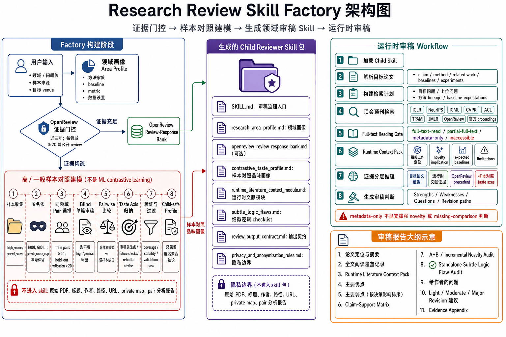
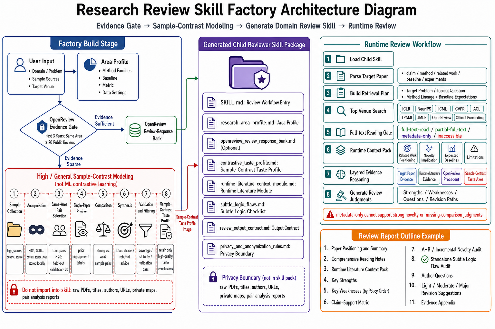

# Research Review Skill Factory

当前版本 / Current package version: `1.1.1`.

## 中文简介

`research-review-skill-factory` 是一个用于生成领域级审稿 skill 的元 skill。最早版本主要是 OpenReview-grounded：定义研究领域画像，检索公开审稿意见，归纳 reviewer concerns 和 accepted-paper response patterns，再生成一个可复用的领域审稿 skill。



最新版本已经升级为一个更完整的“证据编排型审稿 skill 工厂”：它仍然优先使用 OpenReview 公开审稿证据，但会先做严格的证据充足性门控；当 OpenReview 证据不足时，会切换到匿名化的高水平论文 vs 一般水平论文对照式审稿品味建模；生成出的 child skill 在实际审稿时还必须动态检索顶会顶刊相关工作、执行全文阅读 gate，并输出独立的细微逻辑问题审计。

这个元 skill 的主要使用场景是在 Codex 里用自然语言调用：让 Codex 完成证据检索、样本对照建模、child skill 生成、打包和验证。生成后的 child skill 也面向 Codex 审稿流程使用。

## 相比最早版本的重大改进

1. **从 OpenReview-only 升级为 OpenReview-first**
   - 默认使用运行时当前年份和前两年作为 OpenReview 检索窗口。
   - 每个研究领域必须独立满足不少于 `20` 篇相关论文且带公开 review note 的门槛。
   - 多领域请求不能混合凑数；某个领域证据不足，只让该领域进入 fallback。

2. **增加证据稀疏时的对照式审稿品味 fallback**
   - 用户可提供高水平样本和一般水平样本来源，例如顶会/顶刊列表、公开 URL、或本地文件夹。
   - factory 会生成匿名样本 manifest 和本地私有映射。
   - child skill 只保留抽象化的 reviewer taste profile，不保留论文标题、作者、文件名、URL、路径、DOI、arXiv ID 或 private source map。
   - 代码和文件名中保留的 `contrastive` 指“样本对照”，不是机器学习中的 contrastive representation learning。

3. **高/一般样本对照不再只是比较样本，而是先审稿、再比较、再归纳**
   - 每个稀疏领域至少需要 `20` 个同领域 high/general 训练 pair。
   - 默认还需要 document-level held-out validation：验证 pair 数大于 `20` 且至少占选定 pair 数的 `10%`。
   - 单篇论文先 blind-review，不允许直接利用 high/general 标签；标签只在 pair comparison 阶段揭示。
   - reviewer taste 必须从已完成的 pair reviews 中归纳，并通过训练覆盖率、稳定性和验证成功率检查。

4. **增加可替换的 deep-read matched contrastive module**
   - 适用于高水平样本较少、质量要求更高、需要逐篇精读的场景。
   - 模块边界拆成 `domain_adapter`、`deep_reader`、`subfield_matcher`、`pair_comparator`、`taste_synthesizer`、`privacy_filter`。
   - 深读报告、pair 分析和 rationale report 是外部构建产物，不进入 child skill。

5. **生成的 child skill 增加运行时文献上下文模块**
   - 审稿时根据目标论文的问题、相关工作、方法 lineage、baseline、dataset 和 claims 动态检索文献。
   - 相关工作优先来自顶会、顶刊、官方 proceedings 和 OpenReview 等公开评审来源。
   - canonical/high-impact work 用于补充问题脉络和 baseline lineage。
   - preprint 只作为最新线索或补充证据，不能替代已有的正式顶会顶刊版本。

6. **新增 full-text reading gate**
   - 对最近邻相关工作、预期 baseline、用于 novelty 或 missing-comparison 判断的文献，能访问全文时必须打开或下载全文并阅读关键部分。
   - 文献覆盖状态必须标记为 `full-text-read`、`partial-full-text`、`metadata-only` 或 `inaccessible`。
   - metadata-only 文献不能支撑强 novelty、baseline 或 missing-comparison 结论。

7. **细微逻辑问题审计成为独立强制输出**
   - child skill 必须输出 standalone subtle logic flaw audit 表格。
   - 不能只把细微逻辑问题混入普通 weakness list。
   - 不适用的 checklist 项也要显式标记为 `not applicable` 并给出简短理由。

8. **隐私、打包和测试边界更严格**
   - child skill 不打包 raw PDFs、OpenReview raw cache、pair review banks、deep-read reports、pair analyses、rationale reports、validation reports、reading notes、sample manifests 或 `private_source_map.json`。
   - factory 增加了脚本接口和回归测试，防止证据门控、匿名化、full-text gate 和独立 subtle-logic 输出退化。

## 核心设计思想

最新 factory 的核心思想是：**把领域审稿能力从静态模板升级为可审计的证据流水线**。

它由五层组成：

1. **静态领域画像**：定义领域、问题族、方法家族、理论对象、实验设置、baseline、metric 和目标 venue。
2. **证据门控**：先判断 OpenReview 公开审稿证据是否足够；足够则生成 OpenReview review-response bank，不足则进入高/一般样本对照建模 fallback。
3. **可替换样本对照模块**：用高水平/一般水平样本的匿名配对审稿来归纳 reviewer taste，并允许后续替换 deep reader、matcher 或 synthesizer。
4. **运行时文献检索模块**：child skill 审每篇新论文时，必须根据该论文动态构建顶会顶刊相关文献上下文。
5. **硬性输出契约**：强制区分 target-paper evidence、runtime literature evidence、OpenReview 或样本对照 precedent 和 reviewer inference，并输出 claim-support matrix、A+B novelty audit、standalone subtle logic audit、light/moderate/major revision path。

换句话说，child skill 不应该像一套一成不变的 checklist；它应该像一个领域审稿人：知道本领域历史审稿品味，也会在审具体论文时重新查最近和最相关的顶会顶刊工作。

## 使用方法（自然语言调用）

这个仓库里的 skill 面向 Codex 使用。推荐使用方式是：

1. 新建一个项目。
2. 将仓库根目录下的 [research-review-skill-factory-main.zip](research-review-skill-factory-main.zip) 放入这个新项目的资料或文件区。
3. 在对话中参考下面的提示词例子，明确要求使用 `research-review-skill-factory-main.zip` 里的 skill（`research-review-skill-factory`）。

注意：这里要放入新项目的是根目录的 `research-review-skill-factory-main.zip`。`example/federated-learning-reviewer-v1.0.1-build/federated-learning-reviewer-v1.0.1.zip` 是已经生成好的联邦学习审稿 child skill 示例，不是这个元 skill 的安装包。

注意：如果 OpenReview 里的公开审稿意见不足，factory 需要进入样本对照式审稿品味建模。此时用户应当自己提供两类论文材料，并分别放在两个不同文件夹下，例如 `./papers/high_level/` 和 `./papers/general_level/`，分别表示高水平论文和一般水平论文。Codex 也可能被要求先自动检索和收集这两类样本，但当前 skill 没有把“自动收集样本”设定为内置步骤；为了保证过程可审计，推荐显式提供两个文件夹路径。

```text
请使用 research-review-skill-factory-main.zip 里的 skill（research-review-skill-factory），为“半监督联邦学习 + 表征学习理论”生成一个专属审稿 skill。
请先对每个研究领域分别执行最近三年的 OpenReview 证据门控：每个领域至少需要 20 篇带公开审稿意见的相关论文。
如果某个领域证据不足，请使用我提供的两个样本文件夹进行匿名对照式审稿品味建模：./papers/high_level/ 作为高水平论文样本，./papers/general_level/ 作为一般水平论文样本，并生成 child skill。
生成的 child skill 需要包含 runtime literature context module：审稿时优先检索顶会、顶刊、官方 proceedings 和 OpenReview 相关工作，并执行 full-text reading gate。
```

短例子：

```text
请使用 research-review-skill-factory-main.zip 里的 skill（research-review-skill-factory），为 graph neural networks and oversmoothing 生成一个 OpenReview-first 审稿 skill。
如果 OpenReview 证据不足，则切换到 high/general 样本对照式审稿品味建模；高水平论文和一般水平论文需要分别来自两个文件夹。
```

多领域例子：

```text
请使用 research-review-skill-factory-main.zip 里的 skill（research-review-skill-factory），为 “federated semi-supervised learning” 和 “representation learning theory” 生成审稿 skill。
两个领域必须分别满足最近三年 20 篇公开 review 论文的门槛，不能合并计数。
```

样本对照建模例子：

```text
请使用 research-review-skill-factory-main.zip 里的 skill（research-review-skill-factory），为 federated learning 生成审稿 skill。
OpenReview 证据不足时，使用 ./FL_PDFs/录用 作为 high-level 样本，使用 ./FL_PDFs/没录用_撤稿 作为 general-level 样本。
请先对样本匿名化，然后选择同领域 high/general pairs，逐篇 blind-review，再做 pairwise comparison，最后归纳 reviewer taste。这里的 `contrastive` 只表示审稿样本对照，不是机器学习中的 contrastive representation learning。
```

严格深读样本对照例子：

```text
请使用 research-review-skill-factory-main.zip 里的 skill（research-review-skill-factory），为 privacy-preserving federated fine-tuning 生成审稿 skill。
请使用 deep-read matched contrastive module：先精读 curated high-level papers，再为每篇 high-level paper 匹配同子领域或近邻子领域的 general-level paper，逐对比较并归纳审稿关注点。
详细 deep-reading reports、pair analyses 和 rationale reports 只保留为外部构建产物，不进入 child skill。
```

生成后的 child skill 使用例子：

```text
请使用生成的 federated-learning-reviewer-v1.0.1.zip 里的 skill（federated-learning-reviewer）审稿这篇论文。
审稿前请先构建 runtime literature context pack，优先检索顶会/顶刊/官方 proceedings/OpenReview 相关工作。
对最近邻相关工作和预期 baseline 执行 full-text reading gate，并在最终报告中单独输出 Subtle Logic Flaw Audit。
```

## 示例：联邦学习审稿 child skill

`example/` 目录里放了一个已经生成好的联邦学习审稿 skill 示例：[example/federated-learning-reviewer-v1.0.1-build/](example/federated-learning-reviewer-v1.0.1-build/)。

其中 [child-skills/federated-learning-reviewer/](example/federated-learning-reviewer-v1.0.1-build/child-skills/federated-learning-reviewer/) 是生成后的 Codex child skill，[federated-learning-reviewer-v1.0.1.zip](example/federated-learning-reviewer-v1.0.1-build/federated-learning-reviewer-v1.0.1.zip) 是对应的可分发包，[inputs/](example/federated-learning-reviewer-v1.0.1-build/inputs/) 保留了构建该示例用到的领域画像和匿名化审稿品味输入。

## 生成流程概览

1. 生成每个研究领域的 profile。
2. 为每个领域规划 8-20 个 OpenReview queries。
3. 使用运行时当前年份和前两年检索 OpenReview 公开审稿证据。
4. 对每个领域单独检查 `20` 篇公开 review 论文门槛。
5. 证据充足时，生成 OpenReview review-response bank。
6. 证据不足时，选择样本对照模块：默认高通量 train/validation pair workflow，或严格 deep-read matched workflow。
7. 生成匿名 reviewer taste profile，并把详细 pair/rationale/validation 产物留在外部。
8. 给 child skill 加入 runtime literature context module。
9. 生成 child skill，并检查没有 raw evidence、PDF、private map、路径或样本身份信息进入包。

## 生成的 child skill 应该做到什么

生成出的领域审稿 skill 在审具体论文时应当：

- 判断目标论文属于该领域的哪个问题族、方法族和实验设置。
- 读取静态领域 profile、OpenReview bank、样本对照 reviewer taste profile 或两者。
- 构建 runtime literature context pack，而不是只依赖静态模板。
- 优先检索顶会、顶刊、官方 proceedings、OpenReview、canonical/high-impact work。
- 对最近邻相关工作和预期 baseline 执行 full-text reading gate。
- 区分 `full-text-read`、`partial-full-text`、`metadata-only` 和 `inaccessible`。
- 不用 metadata-only 文献支撑强 novelty、baseline 或 missing-comparison 判断。
- 输出 claim-support matrix、A+B/incremental novelty audit、standalone subtle logic flaw audit、reviewer questions、rebuttal plan 和 light/moderate/major revision advice。

## English Overview

`research-review-skill-factory` is a meta-skill for building reusable, research-area-specific reviewer skills. It does not directly review one manuscript. It creates a child reviewer skill for a field, problem family, or method combination, and that child skill can then review future papers in the area.

The intended operating environment is Codex: invoke this meta-skill in Codex with natural language, let Codex run the evidence workflow, generate and validate the child skill, and then use the generated child skill inside Codex review sessions.



It is now an evidence-orchestrating meta-skill, not just an OpenReview scraper. It builds area-specific reviewer skills through:

- an OpenReview-first evidence gate;
- per-area `20` public-review-paper sufficiency checks over the runtime current year and two previous years;
- high-level-vs-general reviewer taste modeling when OpenReview evidence is sparse; this is sample-contrast based review modeling, not representation contrastive learning;
- optional deep-read matched contrastive analysis for curated sample sets;
- privacy-preserving packaging that excludes raw sample identities and private source maps;
- runtime literature retrieval inside generated child skills, with top-conference/top-journal priority;
- a full-text reading gate before strong novelty or baseline judgments;
- mandatory standalone subtle logic flaw audit output.

## English Usage Examples

Use this meta-skill in Codex by creating a new project, adding the root [research-review-skill-factory-main.zip](research-review-skill-factory-main.zip) file to that project, and then using prompts like the examples below.

For the factory workflow, the ZIP to add is the root `research-review-skill-factory-main.zip`. The `example/federated-learning-reviewer-v1.0.1-build/federated-learning-reviewer-v1.0.1.zip` file is a generated federated-learning reviewer child skill example, not the factory package.

Important: if OpenReview does not provide enough public review evidence, the factory falls back to sample-contrast reviewer taste modeling. In that case, the user should provide two paper sets in two separate folders, for example `./papers/high_level/` and `./papers/general_level/`, representing high-level papers and general-level papers. Codex could also be asked to collect those two sample sets automatically first, but this skill does not currently define automatic sample collection as an internal step. For an auditable workflow, explicitly provide the two folder paths.

Build an OpenReview-first area reviewer:

```text
Please use the skill (research-review-skill-factory) inside research-review-skill-factory-main.zip to build a custom review skill for graph neural networks and oversmoothing. Enforce the 20-public-review OpenReview gate over the runtime current year and two previous years. If the area is sparse, switch to high/general sample-contrast reviewer taste modeling, using two separate folders for high-level papers and general-level papers.
```

Build a sparse-field sample-contrast reviewer:

```text
Please use the skill (research-review-skill-factory) inside research-review-skill-factory-main.zip to build a reviewer skill for privacy-preserving federated fine-tuning. If OpenReview evidence is sparse, use ./papers/high_level/ as the high-level sample folder and ./papers/general_level/ as the general-level sample folder. Anonymize all sample identities, perform blind single-paper reviews before pairwise comparison, and generate only a child-safe sample-contrast reviewer taste profile.
```

Use a generated child reviewer:

```text
Please use the skill (federated-learning-reviewer) inside the generated federated-learning-reviewer-v1.0.1.zip to review this paper. Before writing the review, build a runtime literature context pack from top-conference, top-journal, official-proceedings, OpenReview, recent, and canonical related work. Apply the full-text reading gate and include a standalone subtle logic flaw audit.
```

## Example: Federated Learning Reviewer Child Skill

The [example/](example/) directory contains a generated federated learning reviewer skill: [example/federated-learning-reviewer-v1.0.1-build/](example/federated-learning-reviewer-v1.0.1-build/).

[child-skills/federated-learning-reviewer/](example/federated-learning-reviewer-v1.0.1-build/child-skills/federated-learning-reviewer/) is the generated Codex child skill, [federated-learning-reviewer-v1.0.1.zip](example/federated-learning-reviewer-v1.0.1-build/federated-learning-reviewer-v1.0.1.zip) is the distributable package, and [inputs/](example/federated-learning-reviewer-v1.0.1-build/inputs/) keeps the area profile and anonymized reviewer-taste inputs used to build the example.

## License

MIT-0.
